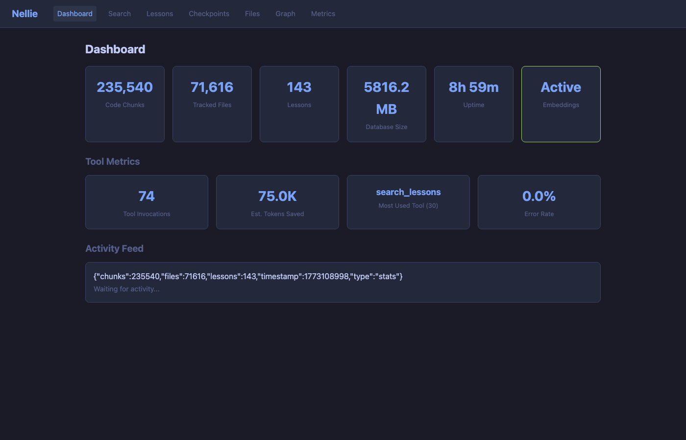
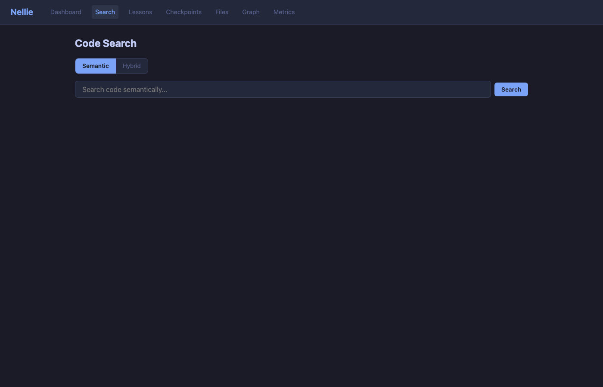
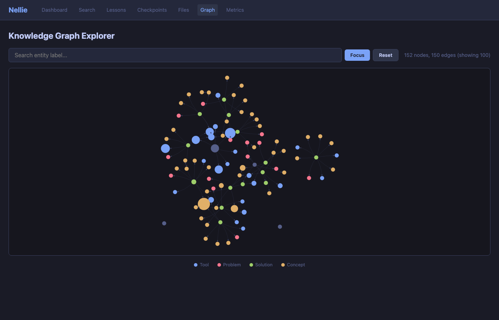
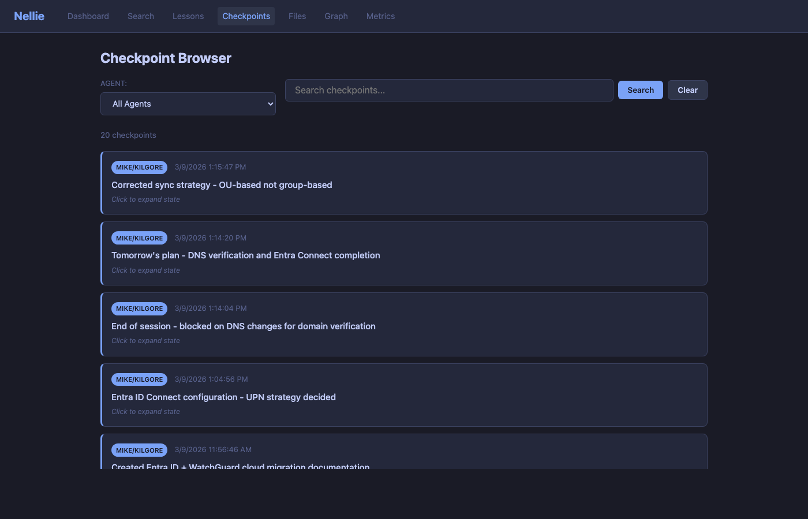
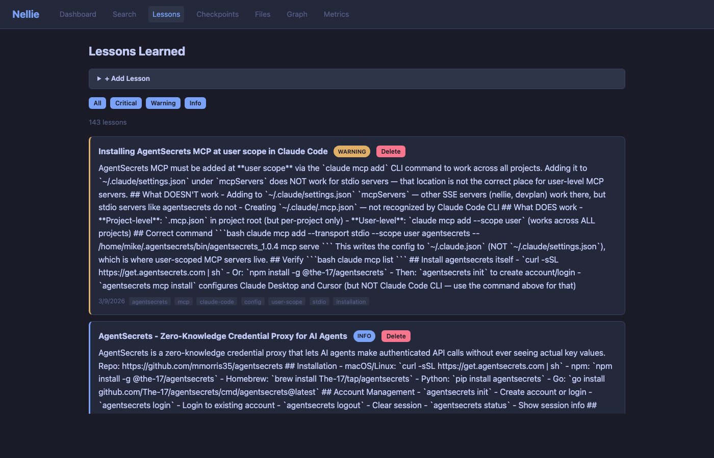
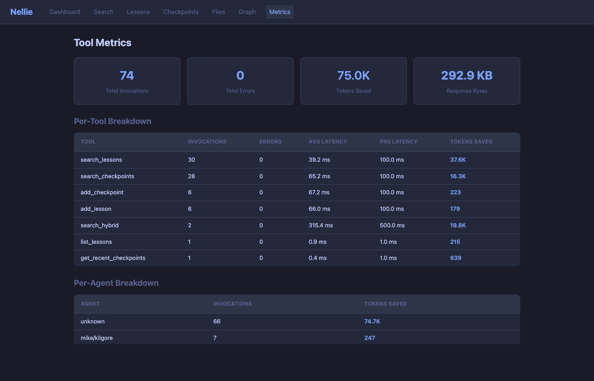

# Nellie

**Semantic Code Memory for AI Agents**

Nellie is a persistent memory server that gives AI coding agents the ability to remember across sessions. It provides semantic code search, a knowledge graph, and automatic context synchronization — so your AI assistant never starts from zero.

Once you use Claude Code with persistent memory, you can't go back to starting from zero every session.

Nellie is an implementation and extension of the [Agent Memory Protocol (AMP)](https://github.com/mmorris35/agent-memory-protocol) — a standard for persistent memory in AI agent systems.

## Get Started in 5 Minutes

```bash
# 1. Build
cargo build --release

# 2. Run with ALL features enabled
./target/release/nellie serve \
  --host 0.0.0.0 \
  --port 8765 \
  --data-dir ~/.local/share/nellie \
  --watch ~/projects \
  --enable-graph \
  --enable-structural \
  --enable-deep-hooks \
  --sync-interval 30

# 3. Connect to Claude Code
claude mcp add nellie --transport sse http://localhost:8765/sse --scope user

# 4. Install hooks (auto-sync + proactive injection)
nellie hooks-install --server http://localhost:8765
```

**What `hooks-install` gives you:**
- **SessionStart** — syncs lessons and checkpoints into Claude Code memory files automatically on every session start
- **UserPromptSubmit** — searches your knowledge base on every prompt and injects relevant context before Claude sees your message (800ms, fail-open)
- **Stop** — ingests session transcripts for new lessons when you finish working

**What the flags do:**
- `--enable-graph` — Knowledge graph that tracks relationships between tools, problems, and solutions
- `--enable-structural` — Tree-sitter AST analysis for structural code search (Python, TypeScript, Rust, Go)
- `--enable-deep-hooks` — Background daemon for automatic transcript ingestion and periodic sync
- `--sync-interval 30` — Sync lessons/checkpoints to Claude Code memory files every 30 minutes
- `--watch ~/projects` — Auto-index code changes in your project directories

Then add the [CLAUDE.md snippet](docs/claude-md-snippet.md) to teach your AI agent how to use Nellie.

**New to Nellie?** Read the [Complete Usage Guide](docs/USAGE_GUIDE.md) — covers naming conventions, the session protocol, when to save lessons and checkpoints, searching effectively, and bootstrapping your first knowledge base.

## Features

- **Persistent Lessons & Checkpoints** — Record insights, patterns, and solutions that survive across sessions. Lessons capture what you've learned; checkpoints preserve the exact state (decisions, file paths, next steps) when you pause and resume.

- **Knowledge Graph** — Automatic relationship tracking between tools, problems, solutions, and concepts. The graph learns from your checkpoints and lessons, strengthening useful edges and weakening bad ones over time. Query relationships, not just content.

- **Deep Hooks Integration** — Claude Code integration that syncs automatically on session start and stop. Your lessons and critical warnings pre-load as memory files; session transcripts are passively mined for new knowledge.

- **Structural Code Search** — Tree-sitter based AST search to find functions, classes, imports, and patterns by syntax structure. Blast radius analysis, call graphs, and code review context across Python, TypeScript, Rust, and Go.

- **Proactive Context Injection** — UserPromptSubmit hook searches your knowledge base on every prompt and injects relevant lessons before Claude sees your message. You don't have to remember to search — Nellie surfaces what you need automatically.

- **Semantic Code Search** — Vector embeddings across indexed repositories for cross-project concept search. Complements structural search and the knowledge graph as one of several retrieval strategies.

- **MCP Server** — Model Context Protocol with 15+ tools for explicit control: search, add/delete lessons, manage checkpoints, query the knowledge graph, index repositories, get agent status.

- **File System Watcher** — Automatic reindexing as you edit. New files and changes are detected and indexed incrementally without slowing down your workflow.

- **Web Dashboard** — Browse lessons, search checkpoints, query the knowledge graph, and manage indexed repositories through a clean web interface.

## Screenshots

### Dashboard

Live stats, tool metrics, and activity feed.

### Semantic & Hybrid Search

Vector search + knowledge graph expansion.

### Knowledge Graph Explorer

Interactive force-directed graph with color-coded entity types.

### Checkpoint Browser

Per-agent filtering, text search, expandable state JSON.

### Lessons Learned


### Tool Metrics

Per-tool and per-agent invocation counts, latency, token savings.

## Quick Start

```bash
# Build from source
cargo build --release

# Run the server
./target/release/nellie serve \
  --host 127.0.0.1 \
  --port 8765 \
  --data-dir ~/.local/share/nellie \
  --watch ~/projects

# Add as MCP server to Claude Code
claude mcp add nellie --transport sse http://localhost:8765/sse --scope user

# Install Deep Hooks (auto sync with Claude Code)
nellie hooks-install
```

The server binds to `127.0.0.1:8765` by default. Access the dashboard at http://localhost:8765.

## Configuration

Key options for `nellie serve`:

```
--host <HOST>                 Server address (default: 127.0.0.1)
--port <PORT>                 Server port (default: 8765)
--data-dir <DIR>              Data storage location (default: ~/.local/share/nellie)
--watch <DIR>                 Directories to index (can be specified multiple times)
--enable-graph                Enable knowledge graph (default: enabled)
--enable-structural           Enable tree-sitter AST search (default: enabled)
--sync-interval <MINUTES>     Reindex check interval (default: 30)
```

Configuration is also read from `~/.config/nellie/config.toml` if present.

## MCP Tools

Available tools when Nellie is added as an MCP server:

- **search_hybrid** — Vector search + graph expansion. Returns code snippets enriched with related concepts, tools, and problems.
- **search_code** — Semantic code search across indexed repositories.
- **search_lessons** — Find lessons by natural language query.
- **add_lesson** — Record a new lesson with optional graph metadata (severity, solved_problem, used_tools, related_concepts).
- **delete_lesson** — Remove a lesson by ID or pattern.
- **list_lessons** — List all lessons with optional filtering by severity.
- **add_checkpoint** — Save agent state: decisions, file paths, next steps, tools used, problems encountered, outcome.
- **search_checkpoints** — Find checkpoints by semantic query.
- **get_recent_checkpoints** — Retrieve the N most recent checkpoints (optionally filtered by agent).
- **query_graph** — Traverse the knowledge graph by entity type, label, or relationship.
- **get_status** — Server health and index statistics.
- **get_agent_status** — Current status for a specific agent.
- **index_repo** — Index a repository or directory on demand.
- **trigger_reindex** — Force reindexing of a path.
- **diff_index** — Incremental reindex (only new/changed files).
- **full_reindex** — Complete reindex from scratch (clears existing data first).

## Deep Hooks (Claude Code Integration)

Nellie integrates directly into Claude Code's lifecycle. Install hooks once:

```bash
nellie hooks-install
```

This configures two automatic hooks:

1. **SessionStart** — Runs `nellie sync` to pull lessons and checkpoints into memory files before your first prompt. Critical/warning lessons become conditional rules.

2. **Stop** — Runs `nellie ingest` to parse the session transcript for new patterns and automatically record lessons.

Your lessons pre-load as memory files at `~/.claude/projects/<project>/memory/`. Critical and warning lessons also appear as conditional rules at `~/.claude/rules/`.

## CLI Commands

```bash
# Run the server
nellie serve [--host HOST] [--port PORT] [--data-dir DIR] [--watch DIR] [--enable-graph] ...

# Sync lessons/checkpoints into Claude Code memory
nellie sync [--project DIR] [--rules] [--dry-run] [--server URL]

# Parse session transcripts and record new lessons
nellie ingest [--project DIR] [--since 1h] [--dry-run] [--server URL]

# Manage Deep Hooks
nellie hooks-install
nellie hooks-uninstall
nellie hooks-status [--json]
```

## Building from Source

### Prerequisites

- Rust 1.75 or later
- System dependencies for tree-sitter:
  - Linux: `libclang-dev` (Debian/Ubuntu) or `clang-devel` (RHEL/Fedora)
  - macOS: Xcode Command Line Tools (automatic on first `cargo` run)

### Build Steps

```bash
git clone https://github.com/mmorris35/nellie.git
cd nellie
cargo build --release
```

The binary is at `target/release/nellie`.

## Usage Examples

### Record a Lesson

```rust
// Save a lesson about a pattern you discovered
mcp_tool::add_lesson {
  title: "Nonce reuse with ChaCha20 breaks confidentiality",
  content: "Reusing a nonce with the same key in ChaCha20-Poly1305 or AES-GCM completely breaks confidentiality. An attacker can XOR two ciphertexts to recover plaintext. Use counter-based nonces with persistent state or large nonce spaces like XChaCha20.",
  tags: ["crypto", "security", "gotcha"],
  severity: "critical",
  solved_problem: "Cryptographic key material being leaked due to improper nonce handling",
  used_tools: ["rustcrypto", "chacha20poly1305"],
  related_concepts: ["AEAD", "replay detection", "timing side channels"]
}
```

### Save a Checkpoint

```rust
// Preserve your exact state when pausing work
mcp_tool::add_checkpoint {
  agent: "user/my-project",
  working_on: "Implementing retry logic with exponential backoff",
  state: {
    decisions: ["Use jitter to prevent thundering herd", "Max 5 retries"],
    flags: { exponential_backoff: true, jitter_enabled: true },
    next_steps: ["Add circuit breaker", "Test with failing service"],
    key_files: ["/src/retry.rs", "/tests/retry_test.rs"]
  },
  tools_used: ["tokio", "backoff"],
  problems_encountered: ["Initial backoff too aggressive"],
  solutions_found: ["Added jitter formula from AWS whitepaper"],
  outcome: "partial"
}
```

### Search Code

```rust
// Find examples of how others handled a problem
mcp_tool::search_hybrid {
  query: "how do I implement connection pooling with timeout",
  expansion_depth: 2,
  limit: 10
}
```

## Knowledge Graph

Nellie maintains a knowledge graph that models relationships between:

- **Agents** — Named AI assistants (`user/my-project`)
- **Tools** — Languages, libraries, frameworks (`Rust`, `tokio`, `async-await`)
- **Problems** — Issues and gotchas (`nonce reuse breaks confidentiality`)
- **Solutions** — Approaches and patterns (`use counter-based nonces`)
- **Concepts** — Architectural or domain ideas (`AEAD`, `circuit breaker`)

Edges are typed (`used`, `solved`, `failed_for`, `knows`, `depends_on`, `related_to`) and weighted by confidence. The graph learns from your checkpoints and lesson metadata, getting stronger with each session.

## Indexing

Nellie uses a multi-strategy indexing approach:

1. **File System Watcher** — Detects new/changed files and reindexes incrementally (default: 30-minute check interval).

2. **Vector Embeddings** — Code is chunked and embedded with a local embedding model. Search returns semantically similar results.

3. **AST/Structural Search** — Tree-sitter parses code into syntax trees. Query by function/class names, imports, or specific node types.

4. **Full-Text Indexing** — Fallback for keyword-based search when vector results are sparse.

All indexing is local — no code leaves your machine.

## Architecture

Nellie is designed to be:

- **Serverless for local use** — Run on your development machine alongside Claude Code.
- **Decentralized for teams** — Can be deployed to a shared server with network isolation (SSH tunnel, VPN).
- **Embedded in AI workflows** — Deep Hooks make it transparent; MCP tools make it explicit and composable.
- **Non-invasive** — Respects `.gitignore` patterns, reads-only (doesn't modify source code).

## Performance Notes

- **First index of large repos** — Tree-sitter parsing can take 5-15 minutes for repos with 10,000+ files. Subsequent syncs are incremental.
- **Vector search** — Local embeddings are fast (~100ms per query) but approximate. Combine with graph expansion for higher relevance.
- **Memory footprint** — Grows with indexed code volume (~50MB per 50,000 files, excluding embeddings).

## License

Apache License 2.0. See [LICENSE](LICENSE) for details.

## Contributing

Contributions are welcome. Please open an issue for feature requests or bugs.

---

**Get started:** Clone, build, run `nellie serve`, and add to Claude Code with MCP. Your AI assistant will remember everything.
