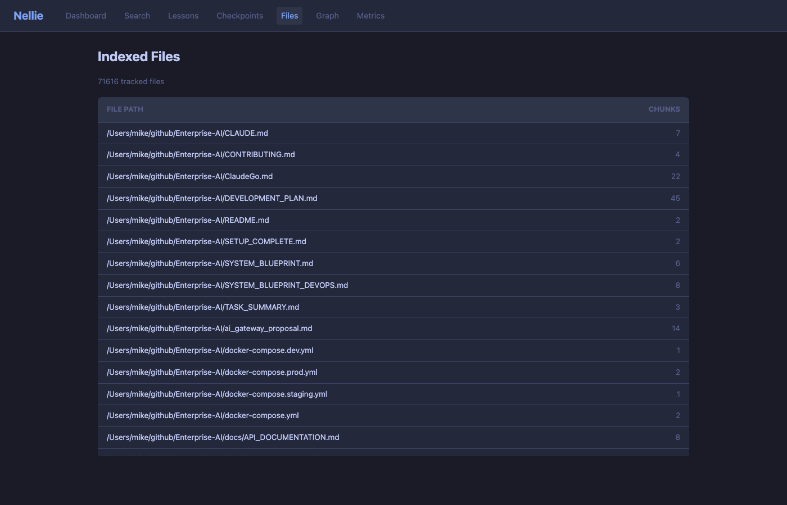

# Nellie-RS

Your AI agent's **code memory** — semantic search, structural code analysis, lessons learned, checkpoint recovery, a self-improving knowledge graph, and automatic Claude Code integration via Deep Hooks.

[](https://github.com/mmorris35/nellie-rs/actions/workflows/ci.yml)
[](https://github.com/mmorris35/nellie-rs/releases)
[](LICENSE)

## What is Nellie?

Nellie is a local semantic code search server that gives AI agents persistent memory:

- **Structural Code Search** — Tree-sitter AST parsing for blast-radius analysis, call graphs, and code review context (Python, TypeScript, JavaScript, Rust, Go)
- **Deep Hooks** — Automatic Claude Code integration: lessons and checkpoints sync to native memory files at session start, transcripts are mined for new knowledge at session end
- **Semantic Code Search** — Find code by meaning, not just keywords
- **Lessons Learned** — Teach Nellie patterns, mistakes, and preferences (or let it learn passively from transcripts)
- **Checkpoints** — Save/restore agent working context for quick recovery
- **Knowledge Graph** — Tracks relationships between tools, problems, solutions, and structural code edges (calls, imports, inherits, tests, contains)
- **Hybrid Search** — Vector similarity + graph expansion + structural context for the richest results
- **Passive Learning** — Automatically extracts corrections, failures, decisions, and tool preferences from session transcripts
- **File Watching** — Auto-indexes code changes in real-time
- **Cross-Machine** — Remote `--server` flag for syncing from any machine on the network
- **Fast** — SQLite + sqlite-vec for local vector search, ONNX embeddings, Tree-sitter parsing at ~280µs/file

## Web Dashboard

Nellie includes a built-in web dashboard at `/ui` with real-time metrics, semantic search, checkpoint browsing, and an interactive knowledge graph explorer.

### Dashboard Overview

Live stats, tool metrics, and activity feed with 10-second auto-refresh.

### Semantic & Hybrid Search

Toggle between pure semantic search and hybrid search (vector + knowledge graph expansion).

### Checkpoint Browser

Browse agent checkpoints with per-agent filtering, text search, and expandable state JSON.

### Knowledge Graph Explorer

Interactive force-directed graph visualization with color-coded entity types. Click nodes to explore neighborhoods.

### Tool Metrics

Per-tool and per-agent metrics: invocation counts, latency histograms, token savings estimates.

### Lessons Learned


### Indexed Files


## Get Started in 5 Minutes

### Quick Install (recommended)

```bash
git clone https://github.com/mmorris35/nellie.git && cd nellie
bash packaging/install-universal.sh
```

This handles everything: Rust toolchain, build tools, ONNX Runtime, embedding model, build, service setup, and bootstrap lessons. When it finishes, Nellie is running with all features enabled.

### Manual Build

**Prerequisites:** Rust 1.75+, C compiler, pkg-config, OpenSSL headers, libclang

```bash
# Ubuntu/Debian
sudo apt install -y build-essential pkg-config libssl-dev libclang-dev
```

```bash
git clone https://github.com/mmorris35/nellie.git && cd nellie
cargo build --release
./target/release/nellie setup          # downloads ONNX Runtime + embedding model
./target/release/nellie bootstrap      # imports starter lessons
```

### Connect to Claude Code

```bash
# Start the server (all features enabled)
./target/release/nellie serve \
  --host 0.0.0.0 --port 8765 \
  --data-dir ~/.local/share/nellie \
  --watch ~/projects \
  --enable-graph --enable-structural --enable-deep-hooks \
  --sync-interval 30

# In another terminal:
claude mcp add nellie --transport sse http://localhost:8765/sse --scope user
nellie hooks-install --server http://localhost:8765

# Verify
curl http://localhost:8765/health
nellie list-lessons    # should show bootstrap lessons
```

## Architecture

```
┌───────────────────────────────────────────────────────────────────────────┐
│                              Nellie-RS                                     │
├───────────────────────────────────────────────────────────────────────────┤
│  ┌──────────┐ ┌──────────┐ ┌──────────┐ ┌──────────┐ ┌──────────────┐   │
│  │  MCP API │ │ Embedding│ │   File   │ │Knowledge │ │  Tree-sitter │   │
│  │(SSE/HTTP)│ │  (ONNX)  │ │  Watcher │ │  Graph   │ │  Structural  │   │
│  └────┬─────┘ └────┬─────┘ └────┬─────┘ └────┬─────┘ └──────┬───────┘   │
│       │            │            │             │               │           │
│  ┌────┴─────┐      │            │             │               │           │
│  │Deep Hooks│      │            │             │               │           │
│  │sync/inge │      │            │             │               │           │
│  └────┬─────┘      │            │             │               │           │
│       └────────────┼────────────┼─────────────┼───────────────┘           │
│                    ▼            ▼             ▼                            │
│  ┌────────────────────────────────────────────────────────────────────┐   │
│  │                  SQLite + sqlite-vec (embedded)                     │   │
│  │  vectors · chunks · lessons · checkpoints · graph · symbols · edges │   │
│  └────────────────────────────────────────────────────────────────────┘   │
└───────────────────────────────────────────────────────────────────────────┘
         │                                                    ▲
         ▼                                                    │
┌─────────────────────┐                              ┌────────────────┐
│  ~/.claude/memory/   │  ◄── nellie sync ──────────  │  Session       │
│  ~/.claude/rules/    │                              │  Transcripts   │
│  (native CC files)   │  ──── nellie ingest ──────► │  (.jsonl)      │
└─────────────────────┘                              └────────────────┘
```

## Knowledge Graph

Nellie's in-memory knowledge graph tracks relationships between entities and learns from outcomes over time. Enable it with `--enable-graph`.

### How It Works

When agents save lessons and checkpoints with structured metadata (tools used, problems encountered, solutions found), Nellie builds a graph of relationships. When you search, `search_hybrid` uses vector similarity *plus* graph traversal to surface related tools, solutions, and concepts you wouldn't find with vector search alone.

### Entity Types

| Type | Examples |
|------|----------|
| **Agent** | `claude`, `mmn/nellie-rs` |
| **Tool** | `cargo`, `reqwest`, `git` |
| **Problem** | `OAuth timeout`, `WAL lock contention` |
| **Solution** | `use async/await`, `enable WAL2 mode` |
| **Concept** | `MCP`, `HTTP routing`, `embeddings` |
| **Person** | `Mike` |
| **Project** | `nellie-rs`, `whag` |
| **Chunk** | Links to indexed code snippets |

### Relationship Types

| Relationship | Meaning |
|-------------|---------|
| `used` | Agent/Problem used a Tool |
| `solved` | Solution solved a Problem |
| `failed_for` | Solution failed for a Problem |
| `related_to` | Generic relationship |
| `derived_from` | Learned from a source |
| `depends_on` | Tool/Project depends on another |
| `knows` | Person knows a Concept/Tool |
| `prefers` | Agent/Person prefers a Tool/Approach |

### Confidence & Reinforcement

Every edge has a confidence score (0.0–1.0) that evolves based on outcomes:

- **New edges** start at 0.3 (provisional)
- **Success outcome** reinforces edges: confidence += 0.2
- **Failure outcome** weakens edges: confidence -= 0.15
- **2+ successes** confirms a provisional edge as permanent
- **Decay** applies over time (30-day half-life by default)
- **Garbage collection** removes edges below 0.05 confidence

This means the graph gets smarter the more you use it — useful relationships strengthen, bad ones fade away.

### Graph-Aware Checkpoints & Lessons

When saving checkpoints and lessons, include graph fields to feed the knowledge graph:

**Checkpoint graph fields:**
```json
{
  "agent": "mmn/nellie-rs",
  "working_on": "Fix OAuth timeout",
  "state": { "..." },
  "tools_used": ["reqwest", "cargo"],
  "problems_encountered": ["OAuth timeout on production"],
  "solutions_found": ["increase connection pool size"],
  "graph_suggestions_used": ["edge_abc"],
  "outcome": "success"
}
```

**Lesson graph fields:**
```json
{
  "title": "Fix OAuth timeout",
  "content": "...",
  "tags": ["oauth", "timeout"],
  "severity": "critical",
  "solved_problem": "OAuth timeouts on production",
  "used_tools": ["reqwest"],
  "related_concepts": ["async/await", "HTTP client"]
}
```

### Bootstrapping

Seed the graph from existing lessons and checkpoints:

```bash
curl -X POST http://localhost:8765/mcp/invoke \
  -H "Content-Type: application/json" \
  -d '{"name": "bootstrap_graph", "arguments": {"mode": "dry_run"}}'

# Preview looks good? Apply it:
curl -X POST http://localhost:8765/mcp/invoke \
  -H "Content-Type: application/json" \
  -d '{"name": "bootstrap_graph", "arguments": {"mode": "execute"}}'
```

## Structural Code Search

Nellie v0.5.0 adds Tree-sitter AST parsing for structural code intelligence. Enable it with `--enable-structural`.

### What It Does

When structural analysis is enabled, Nellie parses every indexed file into an AST and extracts:
- **Functions, classes, methods** — with line numbers, signatures, and scope (which class a method belongs to)
- **Imports** — what each file depends on
- **Call sites** — which functions call which
- **Test functions** — identified by naming conventions (`test_*`, `Test*`, `it()`, `describe()`)

These become edges in the knowledge graph: `Calls`, `Contains`, `ImportedBy`, `Inherits`, `Tests`.

### Supported Languages

| Language | Extensions | Symbols Extracted |
|----------|-----------|-------------------|
| Python | `.py` | functions, classes, methods, imports, calls, test functions |
| TypeScript | `.ts`, `.tsx` | functions, arrow functions, classes, interfaces, imports, Jest tests |
| JavaScript | `.js`, `.jsx` | functions, arrow functions, classes, imports, calls |
| Rust | `.rs` | functions, structs, enums, traits, impl methods, use declarations, `#[test]` |
| Go | `.go` | functions, methods, type declarations, imports, `Test*` functions |

### New MCP Tools

| Tool | Use Case |
|------|----------|
| `get_blast_radius` | **"What breaks if I change this?"** — Given changed files, returns affected symbols, callers, and test files |
| `query_structure` | **"Who calls this function?"** — Query callers, callees, importers, inheritors, tests, contains |
| `get_review_context` | **"Summarize this PR"** — Token-optimized structural summary (<200 tokens) |

### Example: Blast Radius Before a PR

```bash
curl -X POST http://localhost:8765/mcp/invoke \
  -H "Content-Type: application/json" \
  -d '{"name": "get_blast_radius", "arguments": {"changed_files": ["src/server/mcp.rs"], "depth": 2}}'
```

Returns: affected symbols with file paths and line numbers, deduplicated list of affected files, and test files that should be run.

### Performance

- **~280µs per file** for AST parsing + symbol extraction
- **<2 seconds** incremental re-index for 2000-file projects (only changed files re-parsed)
- **<500ms** blast radius queries
- Grammars compiled into the binary — no runtime download

## MCP Integration

Nellie implements the [Model Context Protocol](https://modelcontextprotocol.io/) for AI assistant integration.

### OpenClaw / Claude Code

Add to your MCP configuration:
```yaml
mcp:
  servers:
    nellie:
      transport: sse
      url: http://localhost:8765/sse
```

### Available Tools

**Search:**

| Tool | Description |
|------|-------------|
| `search_code` | Semantic search across indexed code |
| `search_hybrid` | Vector search + graph expansion for richer context |
| `search_lessons` | Find lessons by natural language |
| `search_checkpoints` | Search checkpoints by content |

**Memory:**

| Tool | Description |
|------|-------------|
| `add_lesson` | Record a lesson learned (with optional graph fields) |
| `list_lessons` | List all lessons |
| `delete_lesson` | Remove a lesson by ID |
| `add_checkpoint` | Save agent working context (with optional graph fields) |
| `get_recent_checkpoints` | Get recent checkpoints, optionally filtered by agent |

**Knowledge Graph:**

| Tool | Description |
|------|-------------|
| `query_graph` | Query the graph directly — find entities, traverse relationships |
| `bootstrap_graph` | Seed the graph from existing lessons and checkpoints |

**Status & Indexing:**

| Tool | Description |
|------|-------------|
| `get_status` | Server stats (chunks, files, lessons) |
| `get_agent_status` | Agent-specific status (idle/in_progress, checkpoint count) |
| `index_repo` | Index a specific directory |
| `trigger_reindex` | Re-index a specific path |
| `diff_index` | Incremental index comparing mtimes |
| `full_reindex` | Clear and rebuild entire index |

**Structural Search** (requires `--enable-structural`):

| Tool | Description |
|------|-------------|
| `get_blast_radius` | Calculate code change impact — which symbols are affected |
| `query_structure` | Query function/class relationships — callers, callees, definitions |
| `get_review_context` | Get semantic context for code review of changed files |

## REST API

| Endpoint | Method | Description |
|----------|--------|-------------|
| `/health` | GET | Health check with version |
| `/sse` | GET | MCP SSE transport |
| `/mcp/tools` | GET | List available tools |
| `/mcp/invoke` | POST | Invoke MCP tool |
| `/api/v1/dashboard` | GET | Dashboard stats |
| `/api/v1/search` | GET | Semantic code search |
| `/api/v1/search/hybrid` | GET | Hybrid search (vector + graph) |
| `/api/v1/lessons` | GET/POST | List or add lessons |
| `/api/v1/lessons/{id}` | DELETE | Delete a lesson |
| `/api/v1/checkpoints` | GET | List checkpoints |
| `/api/v1/agents` | GET | List agents |
| `/api/v1/graph` | GET | Knowledge graph query |
| `/api/v1/metrics` | GET | Tool metrics |
| `/api/v1/files` | GET | Indexed files |
| `/api/v1/activity` | GET | Activity stream |

## Configuration

### CLI Options

```bash
# Server
nellie serve [OPTIONS]
  --host <HOST>          Bind address [default: 127.0.0.1]
  --port <PORT>          Port [default: 8765]
  --data-dir <DIR>       Data directory [default: ~/.local/share/nellie]
  --watch <DIRS>         Directories to watch (comma-separated)
  --enable-graph         Enable the knowledge graph (Nellie-V)
  --enable-deep-hooks    Enable background transcript watcher
  --enable-structural    Enable structural code search (Python, Rust, TypeScript/JavaScript)
  --sync-interval <MIN>  Periodic sync interval in minutes [default: 30]
  --log-level <LEVEL>    Log level: trace/debug/info/warn/error [default: info]

# Setup — download ONNX Runtime and embedding model (for manual builds)
nellie setup [--skip-runtime] [--skip-model] [--data-dir DIR]

# Indexing — index a directory of code
nellie index <path> [--local]  # --local forces local embeddings (no server needed)

# Deep Hooks — Claude Code native memory integration
nellie sync [--rules] [--dry-run] [--budget N] [--server URL]
nellie ingest <file|--project DIR> [--since 1h] [--dry-run] [--server URL]
nellie inject --query <QUERY> [--limit N] [--threshold F] [--timeout MS] [--server URL] [--dry-run]
nellie hooks-install       # Wire up SessionStart + Stop hooks (includes UserPromptSubmit)
nellie hooks-uninstall     # Remove Nellie hooks (preserves others)
nellie hooks-status [--json]  # Check hook health
```

### Environment Variables

| Variable | Description |
|----------|-------------|
| `NELLIE_DATA_DIR` | Data directory path [default: ~/.local/share/nellie] |
| `NELLIE_HOST` | Bind address |
| `NELLIE_PORT` | Server port |
| `NELLIE_ENABLE_GRAPH` | Enable knowledge graph (`true`/`false`) |
| `RUST_LOG` | Log level |

## Service Setup

### macOS (launchd)

```bash
# The installer creates this automatically, or manually:
cat > ~/Library/LaunchAgents/com.nellie-rs.plist << 'EOF'
<?xml version="1.0" encoding="UTF-8"?>
<!DOCTYPE plist PUBLIC "-//Apple//DTD PLIST 1.0//EN" "http://www.apple.com/DTDs/PropertyList-1.0.dtd">
<plist version="1.0">
<dict>
    <key>Label</key><string>com.nellie-rs</string>
    <key>ProgramArguments</key>
    <array>
        <string>~/.nellie-rs/nellie</string>
        <string>serve</string>
        <string>--enable-graph</string>
        <string>--watch</string>
        <string>~/code</string>
    </array>
    <key>RunAtLoad</key><true/>
    <key>KeepAlive</key><true/>
</dict>
</plist>
EOF
launchctl load ~/Library/LaunchAgents/com.nellie-rs.plist
```

### Linux (systemd)

```bash
systemctl --user enable nellie
systemctl --user start nellie
sudo loginctl enable-linger $USER  # Start on boot without login
```

## Multi-Machine Sync with Syncthing

For teams or multi-machine setups, use [Syncthing](https://syncthing.net/) to keep code synchronized:

```
BigDev (source) <-> server <-> workstation <-> laptop
                         |
                    Nellie indexes
                    local copy
```

Nellie watches local directories — Syncthing handles the sync. This avoids slow network filesystem issues (NFS/SMB).

## Indexing Best Practices

### Manual Indexing Tools

When file watching is unreliable (network mounts, large repos), use manual indexing:

| Tool | Use Case |
|------|----------|
| `index_repo` | Index a directory on demand — best for agent startup |
| `diff_index` | Incremental sync comparing mtimes — fast for routine updates |
| `full_reindex` | Nuclear option — clears and rebuilds entire index |

**Tip**: Call `index_repo` when starting work on a repo to ensure Nellie has fresh context.

### Network Filesystem Limitation

**macOS fsevents do not work on NFS/SMB mounts**. The file watcher will start but receive zero events.

**Solutions:**
1. **Syncthing** (recommended) — Sync to local disk, Nellie watches local copy
2. **Polling** — Use `diff_index` via cron/heartbeat for periodic updates
3. **Manual** — Call `index_repo` when you know files changed

## Performance

- **Query latency**: <100ms for 100k+ chunks
- **Indexing**: ~1000 files/minute
- **Memory**: ~500MB for 100k chunks
- **Embedding model**: all-MiniLM-L6-v2 (90MB ONNX)

## Building from Source

**Prerequisites**: Rust 1.75+, C compiler, pkg-config, OpenSSL dev headers, libclang-dev

```bash
# Ubuntu/Debian prerequisites
sudo apt install -y build-essential pkg-config libssl-dev libclang-dev

# macOS prerequisites — Xcode Command Line Tools
xcode-select --install  # skip if already installed
```

```bash
# Clone
git clone https://github.com/mmorris35/nellie-rs.git
cd nellie-rs

# Build
cargo build --release

# Download ONNX Runtime + embedding model
./target/release/nellie setup

# Run tests
cargo test

# Run with debug logging and graph enabled
RUST_LOG=debug cargo run -- serve --enable-graph --watch .
```

## Roadmap

- [x] [Web Dashboard UI](https://github.com/mmorris35/nellie-rs/issues/21) — shipped in v0.3.0
- [x] Deep Hooks — Claude Code native memory integration — shipped in v0.4.0
- [x] Cross-machine sync (`--server` flag) — shipped in v0.4.0
- [x] [Structural Code Search](https://github.com/mmorris35/nellie-rs/issues/40) — Tree-sitter AST parsing, blast-radius, call graphs — shipped in v0.5.0
- [x] MCP `_meta` maxResultSizeChars — no more truncated results — shipped in v0.5.0
- [ ] [PDF Text Extraction](https://github.com/mmorris35/nellie-rs/issues/22)
- [ ] Multi-tenant support
- [ ] Cross-repo structural edges
- [ ] Dead code detection

## How To: Set Up Claude Code with Nellie

There are two ways to use Nellie with Claude Code. **Deep Hooks** (recommended) makes everything automatic. **MCP Tools** give you explicit control for search and manual saves.

### Option A: Deep Hooks (Recommended)

Deep Hooks integrates Nellie directly into Claude Code's native file system. Lessons and checkpoints become memory files that load automatically at session start. Transcripts are mined for new knowledge at session end.

**On the Nellie server (local):**
```bash
nellie hooks-install
```

**On remote machines (most common):**
```bash
ln -sf /path/to/nellie ~/.local/bin/nellie
nellie hooks-install --server http://<NELLIE_HOST>:8765
```

The install bakes the server URL into hook commands, runs an initial sync, creates the memory directory, and warns if `nellie` isn't on PATH.

**Verify:**
```bash
nellie hooks-status
```

You should see checkmarks for all components and a populated `last_sync_time`.

### Option B: MCP Tools (Explicit Control)

MCP tools are still available for direct search, manual lesson/checkpoint saves, and knowledge graph queries. You can use both Deep Hooks and MCP tools together.

```bash
claude mcp add nellie --transport sse http://<NELLIE_HOST>:8765/sse --scope user
```

This gives Claude Code access to `search_hybrid`, `add_lesson`, `add_checkpoint`, `query_graph`, and all other MCP tools listed below.

### What This Gets You

- **Zero-effort context recovery** — Every session starts with Nellie knowledge pre-loaded as memory files and rules
- **Passive learning** — Session transcripts are automatically mined for lessons (corrections, failures, decisions)
- **Critical lessons become rules** — Important knowledge loads into every relevant session as `~/.claude/rules/` files
- **Memory deduplication & decay** — Duplicates are merged, stale entries fade, budget enforcement prevents bloat
- **Semantic code search** — Claude searches your codebase before asking you questions (via MCP)
- **Knowledge graph** — Relationships between tools, problems, and solutions get smarter over time
- **Cross-machine** — `--server` flag lets any machine sync from a central Nellie instance

See [Claude Code + Nellie Setup Guide](docs/CLAUDE_NELLIE_SETUP.md) for the full CLAUDE.md template.

## Prompt-Aware Context Injection

Nellie v0.5.1 adds **context injection** — automatically surfacing relevant lessons before Claude processes each prompt.

### What It Does

When you install Nellie hooks, the `UserPromptSubmit` hook runs just before Claude sees your prompt. It:
1. Extracts your prompt text
2. Searches Nellie for relevant lessons, code, and past solutions
3. Writes matching results to a temporary rules file (`~/.claude/rules/nellie-inject.md`)
4. Claude loads these rules automatically before processing your prompt

This means relevant knowledge is always **in context for every prompt**, without you having to remember to search.

### Configuration

Injection happens automatically via `hooks-install`, but you can customize it:

```bash
# Install with default settings (3 results, 0.6 threshold, 500ms timeout)
nellie hooks-install

# Or customize via the UserPromptSubmit hook in ~/.claude/settings.json
# The hook runs: nellie inject --query "$CC_USER_PROMPT" --limit 3 --threshold 0.6 --timeout 1000
```

### Manual Injection

You can also run injection manually for testing:

```bash
# Test injection without writing files (dry-run)
nellie inject --query "how do I use Nellie?" --dry-run

# Run against a remote Nellie instance
nellie inject --query "authentication" --server http://localhost:8765

# Control relevance threshold (0.0–1.0, default 0.6)
nellie inject --query "test" --threshold 0.8

# Control timeout in milliseconds (default 500ms)
nellie inject --query "test" --timeout 1000
```

### How Injection Deduplicates

Nellie is smart about not re-injecting knowledge you already have in your session memory. Before writing the injection file, it:
1. Reads your existing memory files from `~/.claude/projects/<project>/memory/`
2. Extracts lesson names from their frontmatter
3. Filters out any search results that match existing names
4. Only injects novel knowledge

This prevents the same lesson from being loaded twice.

## Bootstrapping a New Nellie Instance

When you spin up a fresh Nellie, it has no lessons, no checkpoints, and no self-knowledge. Feed it [`NELLIE.md`](NELLIE.md) to seed it with Nellie's own philosophy, usage patterns, and hook configurations.

**In a Claude Code session connected to the new instance:**

```
Read NELLIE.md from this repo and use it to teach this Nellie about itself.
Save the key sections as lessons:
1. The Flywheel — what Nellie is and why it matters
2. Search Before Acting — the most important usage rule
3. Environmental Nellie — the vision for passive learning
4. Hooks — how to wire Nellie into the agent lifecycle automatically
```

This gives the new instance foundational self-knowledge so agents using it understand not just the API, but the purpose behind it. The mechanical usage docs (connection info, curl examples, tool reference) are also in `NELLIE.md` — one file bootstraps the whole thing.

## Documentation

- [How Nellie Works](docs/HOW_NELLIE_WORKS.md) — Plain-language guide for non-technical readers
- [Knowledge Graph Details](docs/NELLIE_V_GRAPH.md) — Deep dive into graph architecture
- [Agent Integration Guide](docs/AGENT_GUIDE.md) — For AI agents installing and using Nellie
- [Claude Code Setup](docs/CLAUDE_NELLIE_SETUP.md) — Nellie integration for Claude Code
- [Operator Guide](docs/OPERATOR_GUIDE.md) — For sysadmins deploying Nellie

## License

MIT License — see [LICENSE](LICENSE)

## Links

- [GitHub Releases](https://github.com/mmorris35/nellie-rs/releases)
- [Issues](https://github.com/mmorris35/nellie-rs/issues)
